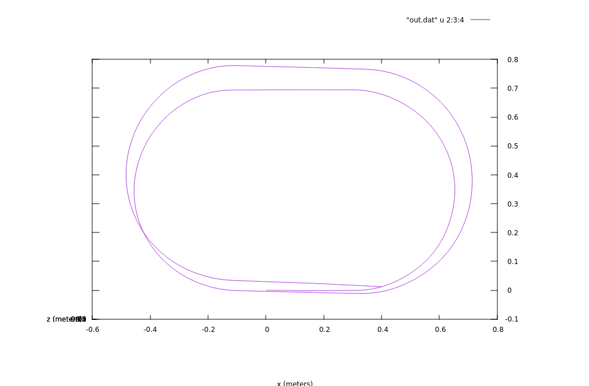

(yet another prototype of)  
## Inertial Navigation System

**Version:** 2.2 2016-08-05

### Release notes:
This version fully supports quaternion 3D calculations.  

<table>
<tr align=center>
<td><b> Version </b></td>
<td><b> Notes </b></td>
</tr>
<tr>
<td align=center valign=top> 2.2 </td>
<td> Math processing functions exported into separate file `engine.c`.<br />
Calibration offsets & factors calculated with more precision<br />
<i>exclusively for my chip.</i></td>
</tr>
<tr>
<td align=center valign=top> 2.1 </td>
<td> Added software low-pass filter.<br />
Some how calculated accelerometer hardware zero offsets. </td>
</tr>
<tr>
<td align=center valign=top> 2.0 </td>
<td> Introduced quaternion-based 3D rotation. </td>
</tr>
</table>

Images of new test placed at `/nav/img`.   

There is still lack of any smart filters.  

Sensors supported: Ivensense MPU-6050 only.  

HW Connection: Sensor is connected to I2C-1 Bus, interrupt line is connected  
to GPIO pin. See .dts file.  

Sensor settings are hardcoded into driver.  

### TODO:
* Introduce smart calibrations.
* Add smart filter(s).
* Export settings of sensor driver to sysfs.

### List of directories:
* `./nav` -- userspace calculation program
* `./drv` -- sensor driver
* `./ref` -- reference materials
* `./pub` -- presentation, public speech
* `./btn` -- utility for demonstrtation, *board-specific*

### Installation:
Copy mknod.sh to your board.  
Edit device tree of your board to add mpu6050 sensor support.   
Look in `bcm2708-rpi-b.dts` for reference.   

On the host computer: go to `./drv`, add you cross compiler to Makefile.  
Run  
``` 
$ make
```
Copy fast-mpu6050.ko to `/lib/modules/<your kernel release>/extra` on your board.   

On your board:  
Run  
```
# depmod
```
Reboot.  
After each reboot of your board you should run  
```
# ./mknod.sh
```
in order to create `/dev/mpu6050` node.  

On the host: go to `./nav`, add you cross compiler to Makefile.  
Run  
```
$ make PLATFORM=board
```
Copy nav to your board.  

On the host:  
Run  
```
$ make
```
This makes the host version of nav. Use it to calculate trajectory.  
Warning: this will rewrite cross-version of nav binary you've  
compiled in previous step.  

### How to run program:
see `./nav/README.md`

---

